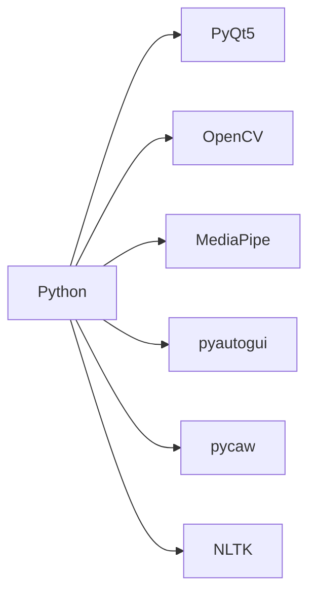
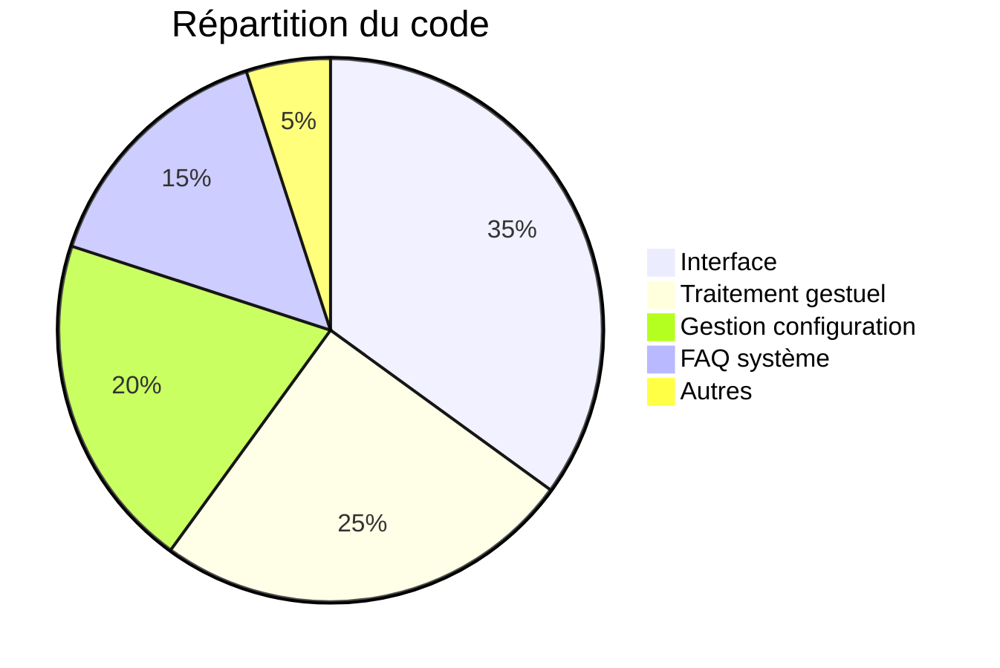

# À propos de GestureMouseApp

## Équipe : 3 etudiant en 1ere annee de cycle ingenieur en Intelligence Articielle et Technologie des Données

| Membre | Rôle | Contact |
|--------|------|---------|
| Marc Thierry NANKOULI | Développeur  | [@Marc1T](https://github.com/Marc1T) |
| CHAIBOU Abdoulaye | Développeur  | [-](https://github.com/Marc1T) |
| El FILALI Halima | Développeur  | [-](https://github.com/Marc1T) |

## Encadrant
### Pr TAWFIK Masrour

## Technologies utilisées



## Licence

GestureMouseApp est distribué sous licence MIT :

```text
Permission est accordée, gracieusement, à toute personne obtenant une copie
de ce logiciel et des fichiers de documentation associés...
```

## Statistiques du projet



## Contact
- Signaler un problème : [Issues GitHub](https://github.com/Marc1T/gestureControl/issues)
- Contribuer : [Fork du projet](https://github.com/Marc1T/gestureControl/fork)
