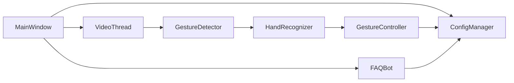
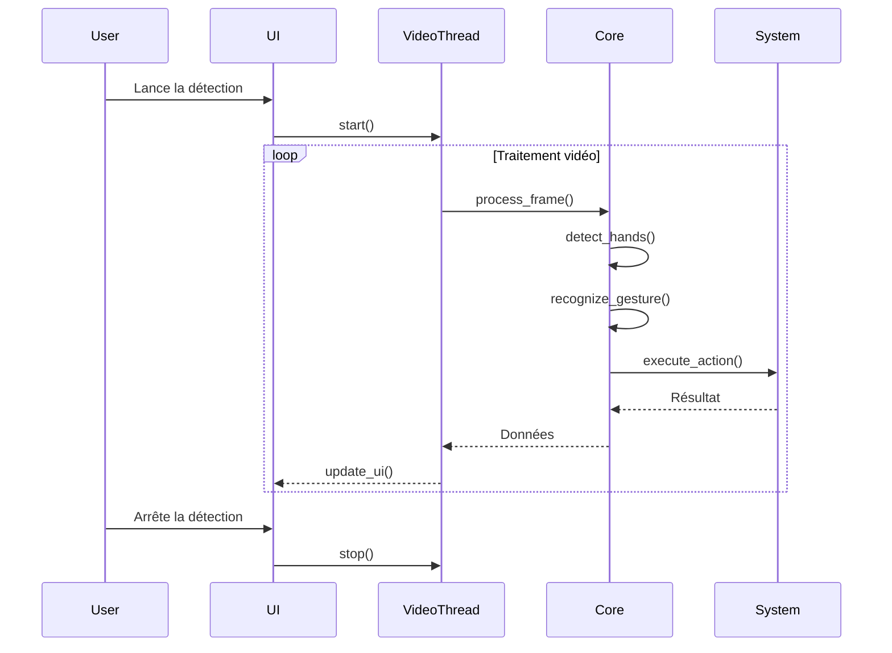
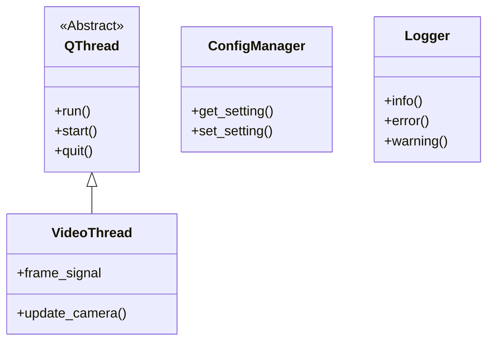

# Référence API complète

## Module Core

### `gesture_detection.py`
::: core.gesture_detection.GestureDetector
    options:
      heading_level: 3
      show_source: true

### `hand_recognition.py`
::: core.hand_recognition.Gest
    options:
      heading_level: 3
      
::: core.hand_recognition.HLabel
    options:
      heading_level: 3
      
::: core.hand_recognition.HandRecognizer
    options:
      heading_level: 3

### `gesture_controller.py`
::: core.gesture_controller.GestureController
    options:
      heading_level: 3

## Module Interface

### `main_window.py`
::: interface.main_window.MainWindow
    options:
      heading_level: 3

### `video_thread.py`
::: interface.video_thread.VideoThread
    options:
      heading_level: 3

### `settings_dialog.py`
::: interface.settings_dialog.SettingsDialog
    options:
      heading_level: 3

### `about_dialog.py`
::: interface.about_dialog.AboutDialog
    options:
      heading_level: 3

## Module Utils

### `config_manager.py`
::: utils.config_manager.ConfigManager
    options:
      heading_level: 3

### `logger.py`
::: utils.logger.Logger
    options:
      heading_level: 3

### `helpers.py`
::: utils.helpers
    options:
      heading_level: 3

## Module Chatbot

### `faq_bot.py`
::: chatbot.faq_bot.FAQBot
    options:
      heading_level: 3

## Relations entre classes

## Diagramme de séquence typique

## Héritage et interfaces

## Exceptions personnalisées

::: utils.config_manager.ConfigError
    options:
      heading_level: 3

::: chatbot.faq_bot.FAQBotError
    options:
      heading_level: 3
