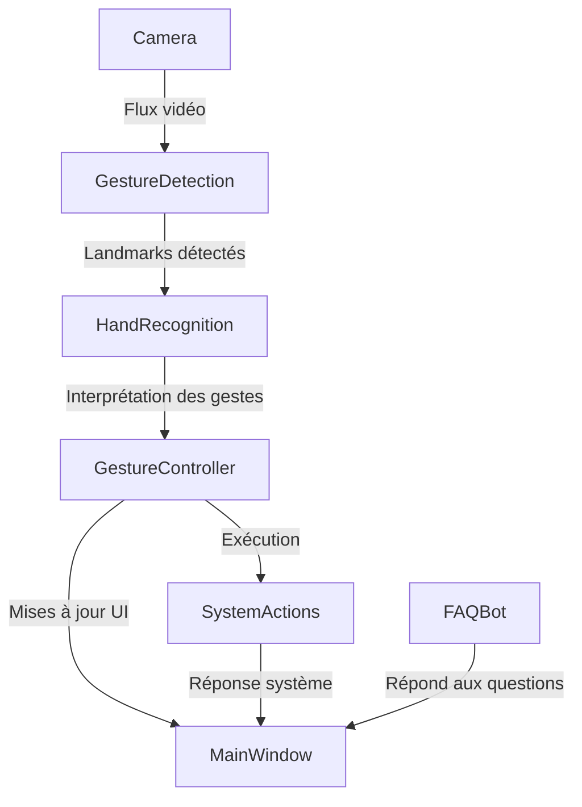

## **Architecture du Projet**  
### **1️⃣ Structure des fichiers (`architecture/files.md`)**  
Le projet **GestureMouseApp** est organisé de manière modulaire pour garantir **flexibilité et évolutivité**.  

#### 📂 **Hiérarchie des fichiers**  
```
GestureMouseApp/
├── main.py                  # Point d'entrée de l'application
├── core/                    # Logique métier principale
│   ├── gesture_detection.py # Détection des mains et capture vidéo
│   ├── hand_recognition.py  # Reconnaissance des gestes spécifiques
│   └── gesture_controller.py# Exécution des actions système
├── interface/               # Interface utilisateur
│   ├── main_window.py       # Fenêtre principale
│   ├── video_thread.py      # Thread de traitement vidéo
│   ├── settings_dialog.py   # Dialogue des paramètres
│   └── about_dialog.py      # Dialogue "À propos"
├── utils/                   # Utilitaires
│   ├── config_manager.py    # Gestion de configuration
│   ├── logger.py            # Système de journalisation
│   └── helpers.py           # Fonctions utilitaires
├── chatbot/                 # Module FAQ
│   └── faq_bot.py           # Chatbot intelligent
├── config/                  # Fichiers de configuration
│   ├── settings.ini         # Paramètres généraux
│   ├── gestures.json        # Mapping gestes-actions
│   └── faq.json             # Base de connaissances FAQ
├── assets/                  # Ressources graphiques
│   ├── logo.png             # Logo de l'application
│   ├── play.png             # Icône de lecture
│   └── ...                  # Autres icônes
└── docs/                    # Documentation
```

✔ **Modularité** – Chaque composant est séparé pour simplifier la maintenance  
✔ **Lisibilité** – Organisation logique facilitant le développement  
✔ **Extensibilité** – Facilité d’ajout de nouvelles fonctionnalités  

---

### **2️⃣ Interaction entre les modules (`architecture/modules.md`)**  
Voici **comment les principaux modules interagissent** dans GestureMouseApp :  

📌 **Flux d’exécution principal** :  
1️⃣ **Capture vidéo** via `gesture_detection.py`  
2️⃣ **Analyse des mouvements** via `hand_recognition.py`  
3️⃣ **Détection des gestes** et interprétation via `gesture_controller.py`  
4️⃣ **Affichage en temps réel** via `video_thread.py` et `main_window.py`  
5️⃣ **Exécution des actions système** selon les gestes détectés  

💡 **Diagramme simplifié des interactions** :
