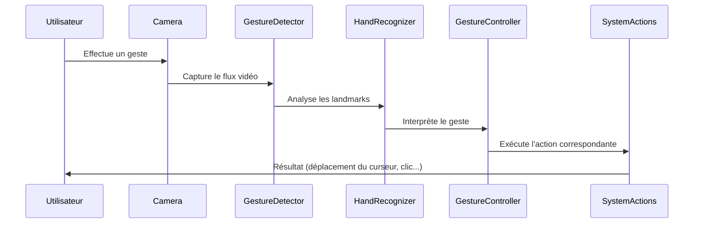

## **Modules détaillés**  
Nous allons détailler chaque **composant clé** du projet **GestureMouseApp**.  

### 📂 **1️⃣ Détection des gestes (`modules/gesture_detection.md`)**  
Ce module gère **la capture vidéo et l’analyse des mains** avec **MediaPipe**.  

✔ **Détecte les landmarks des mains** en temps réel  
✔ **Précision optimisée avec filtrage et stabilisation**  
✔ **Envoie les données aux modules de reconnaissance et contrôle**  

```python
# Extrait de gesture_detection.py
import mediapipe as mp

class GestureDetector:
    def __init__(self):
        self.hands = mp.solutions.hands.Hands()

    def process_frame(self, frame):
        results = self.hands.process(frame)
        return results.multi_hand_landmarks
```
💡 **Ce module est essentiel pour tous les projets nécessitant la reconnaissance des mains !**  

---

### 📂 **2️⃣ Reconnaissance des mains (`modules/hand_recognition.md`)**  
Ce module **interprète les gestes en fonction des positions des doigts**.  

✔ **Encodage binaire pour chaque doigt** 🖐️  
✔ **Classification des gestes** (V-GEST, PINCH, FIST…)  
✔ **Utilisation d’une main dominante pour affiner la détection**  

```python
class HandRecognizer:
    def set_finger_state(self):
        self.fingers = [1 if tip.y < pip.y else 0 for tip, pip in self.finger_positions]
```
💡 **Modulable, ce système peut être réutilisé pour d’autres applications interactives** !  

---

### 📂 **3️⃣ Contrôle des actions (`modules/gesture_controller.md`)**  
Ce module **exécute les actions en fonction des gestes détectés**.  

✔ **Interaction avec le système** (clics, défilement, volume…)  
✔ **Gestion dynamique de la vitesse et précision du curseur**  
✔ **Contrôle intelligent pour éviter les erreurs de reconnaissance**  

```python
import pyautogui

class GestureController:
    def handle_gesture(self, gesture_name):
        if gesture_name == "V_GEST":
            pyautogui.moveTo(500, 300)
        elif gesture_name == "PINCH_MAJOR":
            pyautogui.press("volume_up")
```
💡 **Ce module transforme la détection de gestes en une interaction réelle avec l’ordinateur !**  

---
Voici le **diagramme de séquence** illustrant le fonctionnement général de **GestureMouseApp**, depuis la capture vidéo jusqu’à l’exécution des actions du système.  



✔ **Capture vidéo en temps réel** 🎥  
✔ **Détection des landmarks avec MediaPipe** ✋  
✔ **Interprétation du geste et envoi de commandes** 🖱️  
✔ **Exécution des actions système** (clic, défilement, réglage du volume)  

