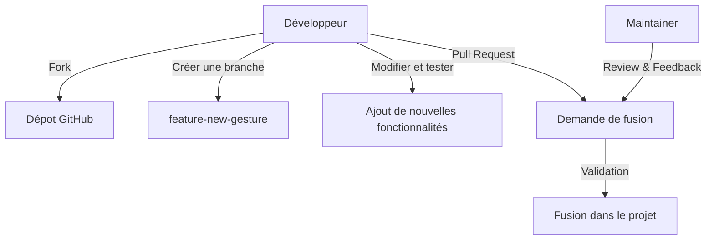

## **– Guide de Contribution**  

### **🔍 Pourquoi contribuer ?**
Le projet **GestureMouseApp** est **open-source**, et chaque contribution **permet d’améliorer la reconnaissance des gestes, d’ajouter des fonctionnalités et de rendre l’application plus accessible** !  

✅ **Proposer de nouveaux gestes et actions système** ✋  
✅ **Optimiser la détection et la précision des mouvements** 🎯  
✅ **Améliorer l’interface utilisateur et le chatbot FAQ** 🤖  

---

### **🔗 Comment contribuer ?**
📌 **Cycle de contribution** :
1️⃣ **Fork du dépôt GitHub**  
2️⃣ **Créer une branche pour les modifications**  
3️⃣ **Développer et tester l’amélioration**  
4️⃣ **Ouvrir une Pull Request (PR)**  

💡 **Exemple de commande Git pour contribuer** :
```bash
git clone https://github.com/Marc1T/GestureMouseApp.git
cd GestureMouseApp
git checkout -b feature-new-gesture
```
🚀 **Une fois les modifications testées, envoyez-les via une PR sur GitHub !**  

---

### **📌 Types de contributions possibles**
📌 **Ajout de nouveaux gestes** – Modifier `gestures.json` et `gesture_controller.py`  
📌 **Optimisation du traitement vidéo** – Améliorer `video_thread.py`  
📌 **Amélioration du chatbot FAQ** – Enrichir `faq.json` et `faq_bot.py`  
📌 **Corrections de bugs et amélioration du code** – Test et reporting  

---

### **🔗 Diagramme du processus de contribution**

💡 **Avec ce workflow, toute contribution est bien organisée et validée !**  

---