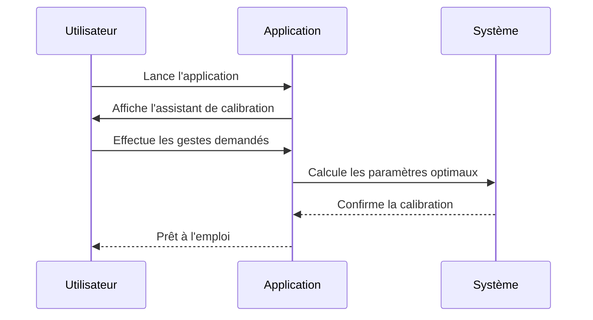
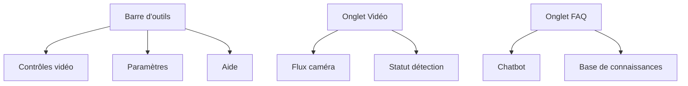

# Premiers pas

## Calibration initiale

## Interface principale

## Gestes fondamentaux

| Geste | Visualisation | Action |
|-------|---------------|--------|
| **V_GEST** |  | Déplacement curseur |
| **FIST** |  | Clic maintenu |
| **PINCH** |  | Défilement |
