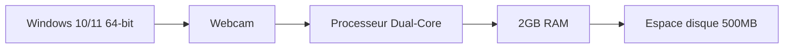
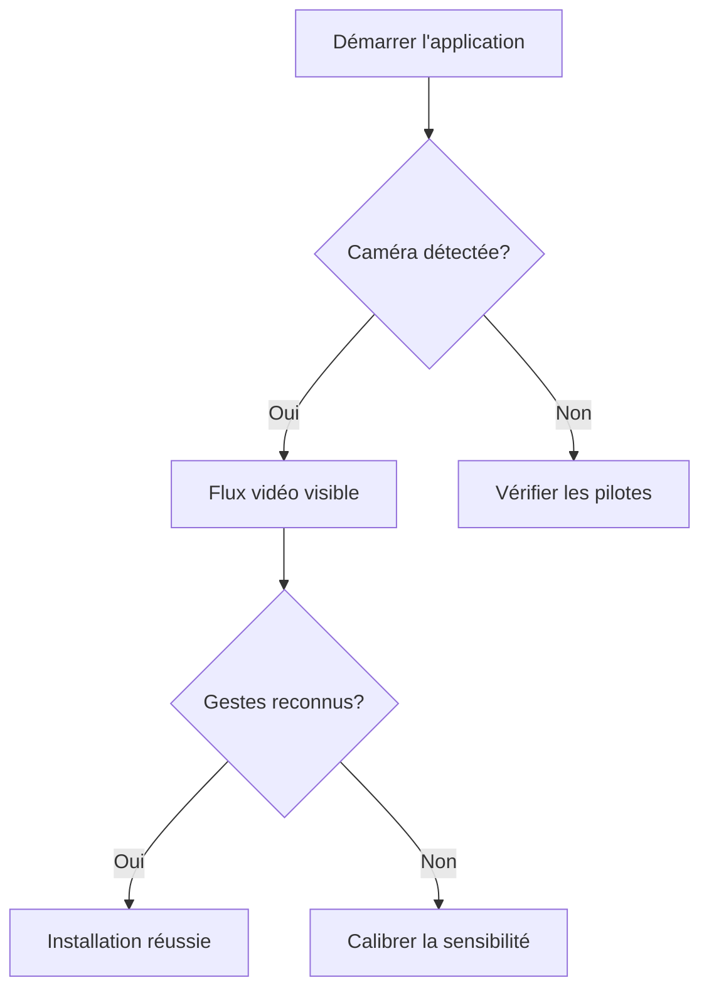

# Installation

## Prérequis système



## Méthodes d'installation

### Installation à partir des sources

```bash
git clone https://github.com/Marc1T/gestureControl.git
cd gestureControl
python -m venv .venv
.\.venv\Scripts\activate
pip install -r requirements.txt
python main.py
```

### Installation via exécutable

1. Téléchargez `GestureMouseApp-Setup.exe` depuis [Releases](https://github.com/Marc1T/gestureControl/releases)
2. Exécutez le programme d'installation
3. Suivez les instructions à l'écran

### Vérification de l'installation



## Problèmes courants

- **Erreur de caméra** : Vérifiez les autorisations et les pilotes
- **Dépendances manquantes** : Installez [VC++ Redistributable](https://aka.ms/vs/17/release/vc_redist.x64.exe)
- **Performances médiocres** : Fermez les applications gourmandes en ressources