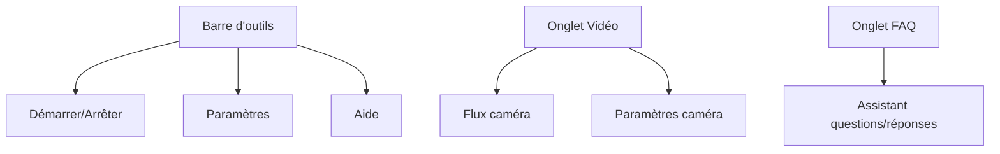

# Guide complet d'utilisation

## Installation

### Prérequis système

- Windows 10/11 (64-bit)
- Webcam compatible (résolution 720p minimum)
- 4 Go de RAM minimum
- [Microsoft Visual C++ Redistributable](https://aka.ms/vs/17/release/vc_redist.x64.exe) (Windows)

### Méthodes d'installation

=== "Exécutable Windows"
    1. Téléchargez le fichier d'installation depuis [Releases](https://github.com/Marc1T/gestureControl/releases)
    2. Exécutez `GestureMouseApp-Setup.exe`
    3. Suivez les instructions de l'assistant d'installation
    4. Lancez l'application depuis le menu Démarrer

=== "Depuis les sources"
    ```bash
    # Cloner le dépôt
    git clone https://github.com/Marc1T/gestureControl.git
    cd gestureControl
    
    # Créer un environnement virtuel
    python -m venv .venv
    
    # Activer l'environnement
    # Windows
    .\.venv\Scripts\activate
    # Linux/macOS
    source .venv/bin/activate
    
    # Installer les dépendances
    pip install -r requirements.txt
    
    # Lancer l'application
    python main.py
    ```

=== "Installation avec pip"
    ```bash
    pip install gesturemouseapp
    gesturemouseapp
    ```

## Premiers pas

### Configuration initiale

1. **Sélection de la caméra** :  
   À la première ouverture, l'application détecte automatiquement votre caméra.  
   Si plusieurs caméras sont disponibles, sélectionnez-la dans les paramètres.

2. **Calibration rapide** :  
   Tenez-vous à environ 50-100 cm de la caméra et effectuez ces gestes :
   - Main ouverte (palm)
   - Signe "V" (v_gest)
   - Pince pouce-index (pinch_major)
   
   L'application ajustera automatiquement les paramètres.

3. **Test des fonctionnalités** :  
   - Déplacez votre main en position "V" pour contrôler le curseur
   - Faites un poing (fist) pour un clic maintenu
   - Pincez avec pouce et index pour ajuster le volume (déplacez la main verticalement)

### Interface utilisateur



## Utilisation avancée

### Gestes supportés

| Geste             | Action                          | Détails                           |
|-------------------|----------------------------------|-----------------------------------|
| `V_GEST`          | Déplacement du curseur          | Main ouverte avec index et majeur écartés |
| `FIST`            | Clic maintenu                   | Main fermée                       |
| `MID`             | Clic gauche                     | Majeur levé                       |
| `INDEX`           | Clic droit                      | Index levé                        |
| `TWO_FINGER_CLOSED` | Double clic                   | Index et majeur joints            |
| `PINCH_MINOR`     | Défilement                      | Pince main non dominante          |
| `PINCH_MAJOR`     | Volume/luminosité               | Pince main dominante              |

### Personnalisation

1. **Modifier les actions** :  
   Éditez le fichier `config/gestures.json` :
   ```json
   {
     "V_GEST": "move_cursor",
     "FIST": "mouse_down",
     "PINCH_MINOR": "scroll"
   }
   ```
   
2. **Ajuster la sensibilité** :  
   Dans Paramètres > Détection :
   - Sensibilité : Contrôle la vitesse du curseur
   - Seuil : Affecte la précision de détection
   
3. **Thèmes d'interface** :  
   Choisissez entre thème clair ou sombre dans Paramètres > Apparence.

## Dépannage

### Problèmes courants

+++ "La caméra n'est pas détectée"
1. Vérifiez les connexions physiques
2. Assurez-vous qu'aucune autre application n'utilise la caméra
3. Essayez une autre caméra dans Paramètres > Caméra
4. Redémarrez l'application

+++ "Les gestes ne sont pas reconnus"
1. Améliorez l'éclairage de la pièce
2. Positionnez-vous face à la caméra sans obstructions
3. Calibrez à nouveau dans Paramètres > Détection
4. Augmentez le seuil de détection

+++ "L'application plante au démarrage"
1. Vérifiez les fichiers de log dans `logs/app.log`
2. Mettez à jour les pilotes de la caméra
3. Réinstallez Microsoft Visual C++ Redistributable
4. Ouvrez un ticket sur [GitHub Issues](https://github.com/Marc1T/gestureControl/issues)

### Journalisation

Les fichiers de log contiennent des informations détaillées pour diagnostiquer les problèmes :

```log
2025-06-15 14:30:45 [INFO] Démarrage de l'application
2025-06-15 14:30:46 [INFO] Caméra détectée : index=0, résolution=1280x720
2025-06-15 14:30:47 [DEBUG] Détection démarrée avec succès
2025-06-15 14:31:20 [INFO] Geste détecté : V_GEST, action: move_cursor
```

Pour augmenter le niveau de détail, modifiez `config/settings.ini` :
```ini
[LOGGING]
log_level = DEBUG
```

<!-- ## Vidéos tutoriels

<div class="grid" markdown>

- [Installation et configuration de base](https://youtu.be/exemple1)
  ```youtube
  https://youtu.be/exemple1
  ```

- [Gestes avancés et personnalisation](https://youtu.be/exemple2)
  ```youtube
  https://youtu.be/exemple2
  ```

</div> -->
