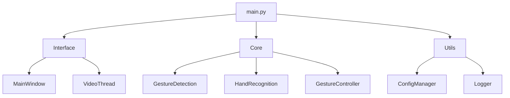
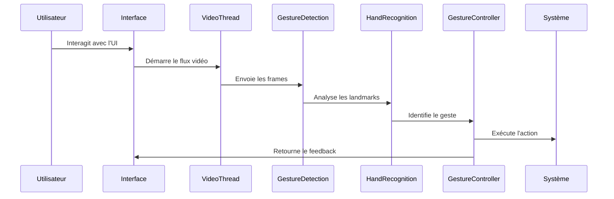

# Architecture du Système

GestureMouseApp suit une architecture modulaire avec une séparation claire des responsabilités :

## Composants Clés

1. **Couche Interface (PyQt5)** :
   - Gestion des fenêtres et dialogues
   - Thread vidéo pour le traitement en temps réel
   - Communication via les signaux/slots

2. **Couche Core (Logique Métier)** :
   - Détection des gestes avec MediaPipe
   - Reconnaissance des gestes spécifiques
   - Exécution des actions système

3. **Couche Utils (Services)** :
   - Gestion de configuration (INI/JSON)
   - Journalisation centralisée
   - Fonctions utilitaires

## Flux de Données

## Principes de Conception

- **Découplage** : Les modules communiquent via des interfaces définies
- **Configurable** : Tous les paramètres sont externalisés
- **Extensible** : Ajout facile de nouveaux gestes ou actions
- **Robuste** : Gestion d'erreurs à tous les niveaux
