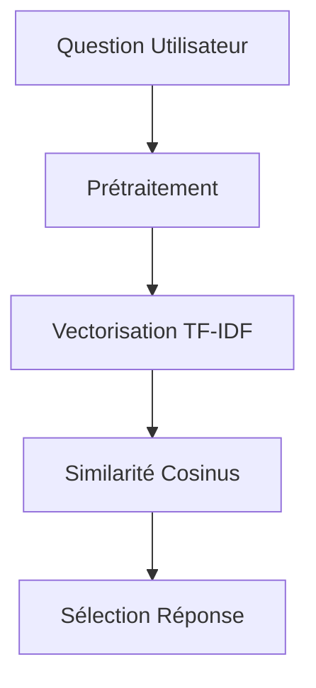

# Système FAQ Intelligent

## Architecture NLP



## Prétraitement du Texte

```python
def _preprocess_text(self, text: str) -> str:
    # 1. Nettoyage
    text = re.sub(r'[^\w\s]', '', text.lower())
    
    # 2. Tokenisation
    tokens = word_tokenize(text, language="french")
    
    # 3. Filtrage et stemming
    tokens = [self.stemmer.stem(t) for t in tokens 
              if t not in self.stop_words and len(t) > 2]
    
    return " ".join(tokens)
```

## Processus de Matching

1. Vectorisation des questions FAQ et de la requête
2. Calcul de similarité cosinus
3. Sélection de la réponse avec le score le plus élevé
4. Application d'un seuil de confiance (0.5 par défaut)

## Extensibilité

- Ajout de questions dans `faq.json`
- Ajustement du seuil dans `settings.ini`

