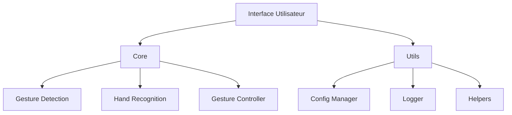
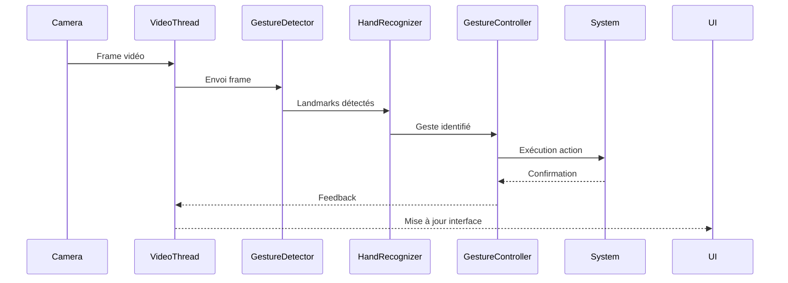
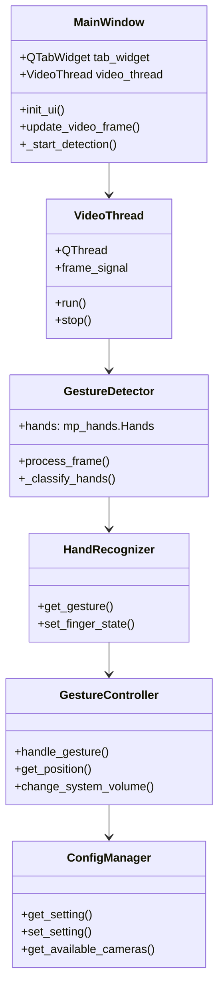

# Architecture et composants

## Vue d'ensemble du système



## Modules clés

### 1. Détection gestuelle

Responsable de la capture vidéo et de l'analyse des mains avec MediaPipe.

**Workflow** :
```python
def process_frame(self):
    # Capture de la frame
    ret, frame = self.cap.read()
    
    # Conversion pour MediaPipe
    frame_rgb = cv2.cvtColor(frame, cv2.COLOR_BGR2RGB)
    
    # Détection des mains
    results = self.hands.process(frame_rgb)
    
    # Analyse des résultats
    if results.multi_hand_landmarks:
        for hand_landmarks in results.multi_hand_landmarks:
            # Dessiner les landmarks
            mp_drawing.draw_landmarks(frame, hand_landmarks, mp_hands.HAND_CONNECTIONS)
    
    return frame, results
```

### 2. Reconnaissance des gestes

Transforme les landmarks en gestes identifiables.

**Algorithme** :
```python
def get_gesture(self):
    # Calcul des distances caractéristiques
    dist_index = self.get_dist([8, 5])  # Index
    dist_middle = self.get_dist([12, 9])  # Majeur
    
    # Calcul des ratios
    ratio_index = dist_index / dist_middle
    
    # Classification selon les seuils
    if ratio_index > self.vgest_threshold:
        return Gest.V_GEST
    elif self.get_pinch_strength() > self.pinch_threshold:
        return Gest.PINCH_MAJOR
    else:
        return Gest.PALM
```

### 3. Contrôleur de gestes

Exécute les actions système correspondant aux gestes.

```python
def handle_gesture(self, gesture, hand_result, hand_label):
    if gesture == Gest.V_GEST:
        x, y = self.get_position(hand_result)
        pyautogui.moveTo(x, y, duration=0.1)
    
    elif gesture == Gest.FIST:
        pyautogui.mouseDown(button="left")
    
    elif gesture == Gest.PINCH_MAJOR:
        self.pinch_control(hand_result, 
                           self.change_system_brightness, 
                           self.change_system_volume)
```

### 4. Gestion de configuration

Centralise l'accès aux paramètres de l'application.

**Chargement des paramètres** :
```python
def _load_config(self):
    self.config.read(self.settings_file)
    
    # Validation des valeurs
    for section in self.config.sections():
        for key in self.config[section]:
            self.config[section][key] = self.validate_param(key, self.config[section][key])
    
    # Valeurs par défaut si manquantes
    if 'DEFAULT' not in self.config:
        self._create_default_config()
```

## Flux de données



## Diagramme de classes



## Décisions d'architecture

1. **Séparation UI/Traitement** :  
   Le traitement vidéo est déporté dans un thread séparé pour ne pas bloquer l'interface.

2. **Configuration externalisée** :  
   Tous les paramètres sont stockés dans des fichiers externes (INI/JSON) pour une modification sans recompilation.

3. **Gestion des dépendances** :  
   Les composants sont faiblement couplés pour faciliter la maintenance et les tests.

4. **Extensibilité** :  
   L'ajout de nouveaux gestes se fait par modification de `gestures.json` sans modifier le code source.

## Performances

| Composant         | Temps moyen | Optimisations                     |
|-------------------|-------------|-----------------------------------|
| Capture vidéo     | 15ms        | Réduction de résolution           |
| Détection mains   | 50ms        | Utilisation de MediaPipe optimisé |
| Reconnaissance    | 5ms         | Algorithmes simplifiés            |
| Exécution action  | 2ms         | Appels système directs            |

**Total par frame** : ~72ms (14 FPS)
