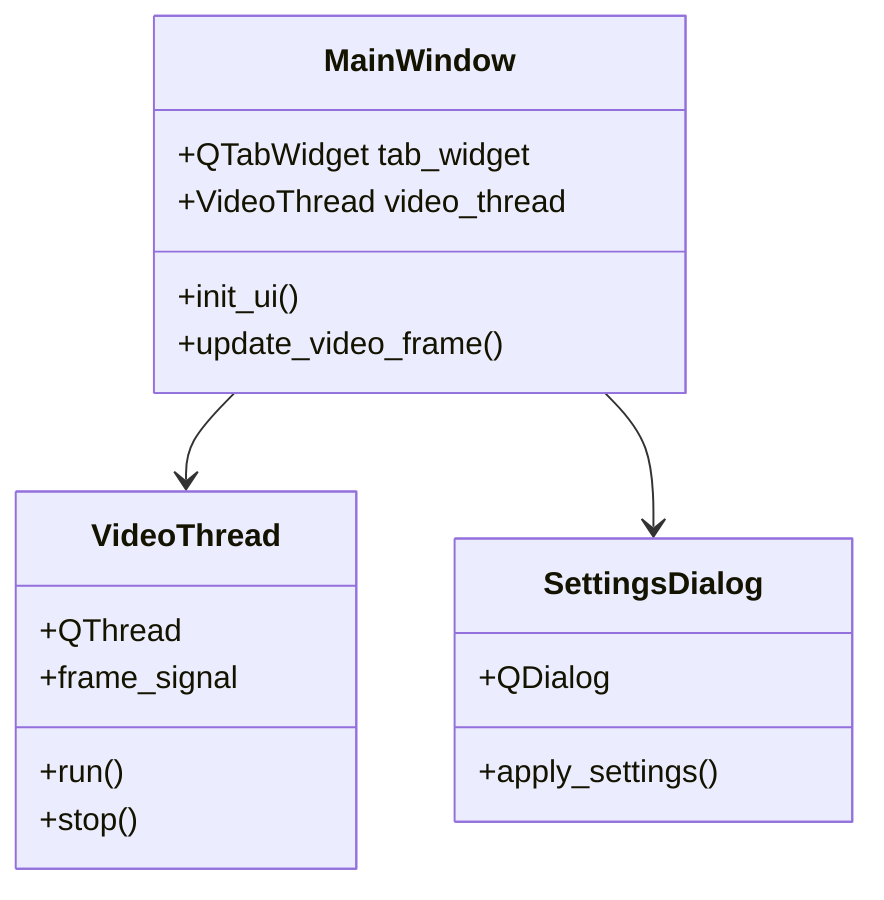

# Système d'Interface Utilisateur

## Architecture PyQt5



## Gestion du Thread Vidéo

L'interface utilise un pattern Producteur-Consommateur :

```python
class VideoThread(QThread):
    frame_signal = pyqtSignal(QImage, str, str)
    
    def run(self):
        while self.running:
            frame = capture_frame()
            processed = process_frame(frame)
            self.frame_signal.emit(processed)
```

## Synchronisation UI-Traitement

1. Le thread vidéo émet un signal avec l'image traitée
2. Le MainWindow reçoit le signal et met à jour l'UI
3. Pas de blocage de l'interface pendant le traitement

## Personnalisation

L'interface utilise des styles CSS configurables :

```ini
[UI]
stylesheet = 
    QMainWindow { background-color: #FFFFFF; }
    QPushButton {
        background-color: #4CAF50; 
        color: white;
    }
```
