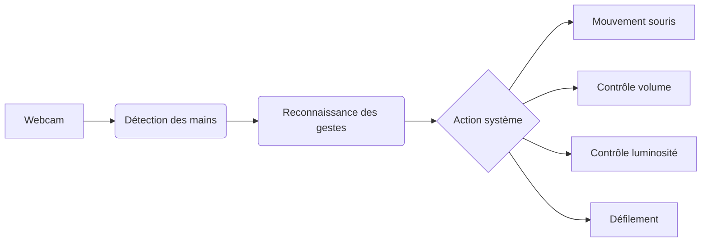
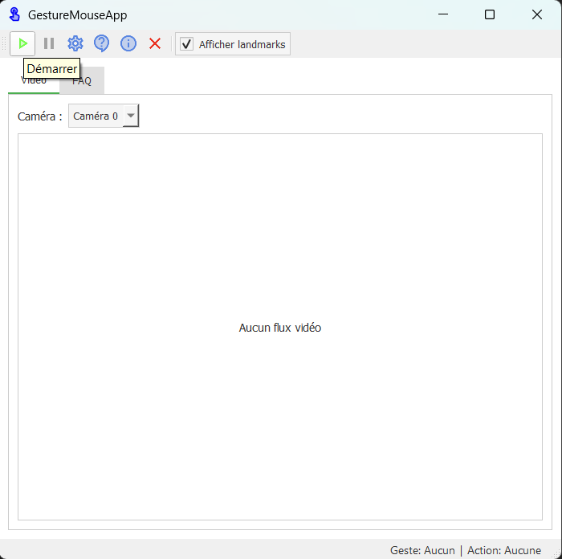
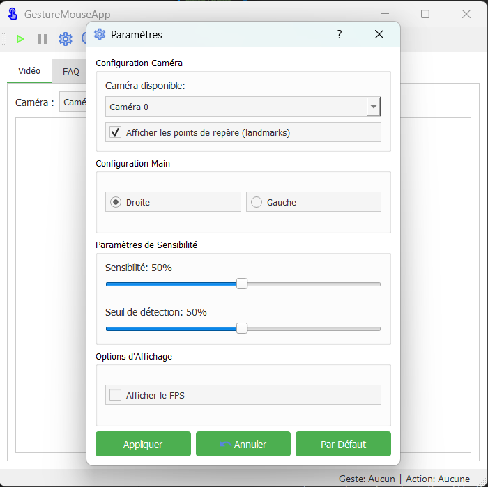
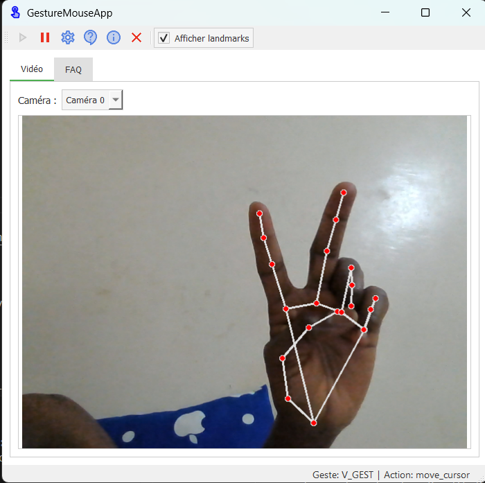
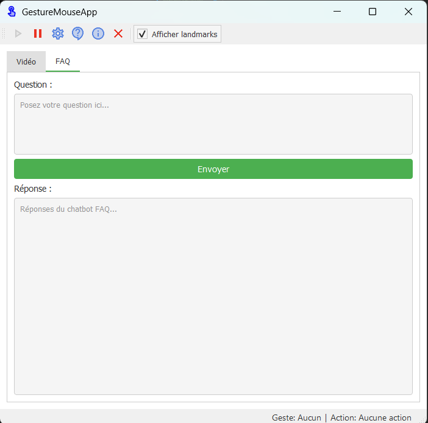

# GestureMouseApp - Contrôle gestuel de votre ordinateur

{ align=left width=100 }

**Une application innovante pour contrôler votre souris, volume et luminosité par des gestes naturels**

[Commencer](guide/user-guide.md){ .md-button } 
[Voir le code source](https://github.com/Marc1T/gestureControl){ .md-button .md-button--secondary }

---

## Fonctionnalités principales

- 🖱️ Contrôle précis du curseur par gestes de la main
- 🔊 Ajustement du volume et de la luminosité par gestes de pincement
- ❓ Assistant FAQ intégré avec intelligence artificielle
<!-- - ⚙️ Interface personnalisable avec thèmes clair/sombre -->
- 📊 Journalisation complète pour le débogage

<!-- 

-   :material-gesture-tap-button:{ .lg .middle } **Contrôle intuitif**
    - Déplacement du curseur
    - Clics gauche/droit
    - Défilement
    - Zoom
    
-   :material-cog:{ .lg .middle } **Personnalisation avancée**
    - Sensibilité ajustable
    - Gestes personnalisables
    - Profils utilisateur
    - Support multi-caméras
    
-   :material-chat-processing:{ .lg .middle } **Assistance intelligente**
    - FAQ intégrée
    - Détection automatique des problèmes
    - Journalisation détaillée

 -->

---

## Captures d'écran

=== "Interface principale"
    

=== "Paramètres"
    

=== "Détection gestuelle"
    

=== "ChatBot FAQ"
    

## Témoignages

> "GestureMouseApp a révolutionné ma façon d'interagir avec mon ordinateur. L'interface est intuitive et la détection des gestes est remarquablement précise."  
> - **Alex D.**, Utilisateur régulier

> "En tant que développeur, j'apprécie particulièrement l'architecture modulaire et la documentation complète qui facilitent la contribution au projet."  
> - **Sarah K.**, Développeuse Python

---

## Dernières mises à jour

- **Version 1.1** (2025-06-15) :  
  - Support multi-écrans ajouté
  - Amélioration de la détection des gestes complexes
  - Interface traduite en 3 langues supplémentaires

- **Version 1.0** (2025-05-01) :  
  - Lancement initial avec toutes les fonctionnalités de base
  - Documentation complète
  - Support Windows

[Voir toutes les versions](https://github.com/Marc1T/gestureControl/releases){ .md-button }