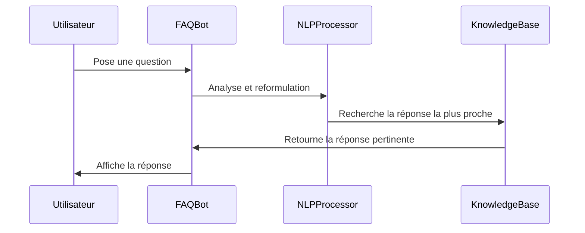

## **– Chatbot FAQ intelligent**  

### **🔍 Rôle du module**
Ce module **répond aux questions des utilisateurs** en s’appuyant sur une **base de connaissances prédéfinie** dans `faq.json`.  
✅ Analyse la requête utilisateur avec NLP 🧠  
✅ Recherche la meilleure réponse disponible 📚  
✅ S’adapte aux questions similaires et reformulées 🔄  

---

### **⚙️ Fonctionnement interne**
📌 **Flux de traitement d’une question FAQ** :
1️⃣ **L’utilisateur pose une question dans l’interface** 💬  
2️⃣ **Le chatbot analyse la phrase avec NLP** 🔍  
3️⃣ **Recherche la correspondance la plus proche dans `faq.json`** 📖  
4️⃣ **Affiche la réponse pertinente ou demande une précision** ✅  

💡 **Exemple de structure de `faq.json`** :
```json
{
    "questions": [
        {
            "q": "Comment modifier les gestes ?",
            "a": "Vous pouvez éditer le fichier `gestures.json` pour personnaliser les actions."
        },
        {
            "q": "Que faire si la caméra ne fonctionne pas ?",
            "a": "Vérifiez votre connexion, redémarrez l'application et testez un autre périphérique."
        }
    ]
}
```

---

### **📌 Diagramme de séquence – Traitement d’une requête FAQ**  


---

### **🔗 Interaction avec l’interface utilisateur**
Le chatbot est **intégré à la fenêtre principale** (`main_window.py`).  
💡 **Exemple d’affichage d’une réponse FAQ** :
```python
from chatbot.faq_bot import FAQBot

faq = FAQBot("config/faq.json")
question = "Comment modifier les gestes ?"
response = faq.get_answer(question)
print(response)  # Affiche la réponse correspondante
```

---

### **🛠️ Personnalisation de la FAQ**
✅ **Ajout de nouvelles réponses**  
Modifiez `faq.json` pour enrichir la base de connaissances.  
✅ **Amélioration du NLP**  
Intégrez **Spacy ou Transformers** pour affiner la compréhension des requêtes complexes.  

---