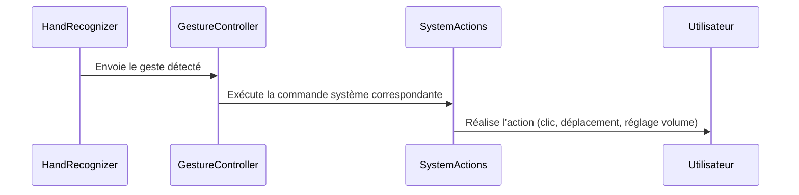

## **– Exécution des actions système**  

### **🔍 Rôle du module**
Ce module **associe les gestes détectés à des actions système**.  
✅ **Déplacement du curseur** 🖱️  
✅ **Clics et actions de la souris**  
✅ **Réglage du volume, luminosité et défilement**  

---

### **⚙️ Fonctionnement interne**
📌 **Cycle de gestion des gestes** :
1️⃣ **Réception du geste depuis HandRecognizer**  
2️⃣ **Association avec une commande système**  
3️⃣ **Exécution de l’action correspondante**  

💡 **Exemple de code – Gestion des actions système** :
```python
import pyautogui

class GestureController:
    def handle_gesture(self, gesture_name):
        """Exécute une action en fonction du geste détecté"""
        if gesture_name == "V_GEST":
            pyautogui.moveTo(500, 300)
        elif gesture_name == "FIST":
            pyautogui.mouseDown()
        elif gesture_name == "INDEX":
            pyautogui.click(button="right")
        elif gesture_name == "PINCH_MAJOR":
            pyautogui.press("volume_up")
```

📌 **Utilisation du module** :
```python
controller = GestureController()
controller.handle_gesture("V_GEST")  # Déplace la souris
```

---

### **🔗 Diagramme de séquence – Exécution des actions système**


---
