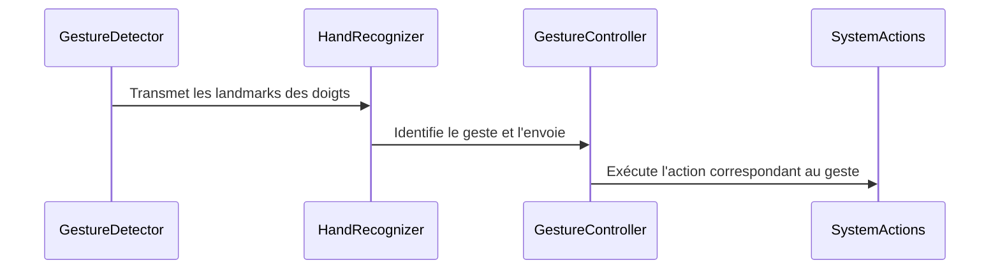

## **– Reconnaissance des mains**  

### **🔍 Rôle du module**
Ce module **analyse la posture des doigts** pour déterminer quel geste est effectué.  
✅ **Détection des doigts ouverts/fermés** ✋  
✅ **Encodage des positions pour interpréter les gestes**  
✅ **Envoi du geste détecté à GestureController pour exécution**  

---

### **⚙️ Fonctionnement interne**
📌 **Cycle de reconnaissance** :
1️⃣ **Lecture des landmarks des doigts** capturés par `gesture_detection.py`  
2️⃣ **Définition de l’état des doigts** (ouvert/fermé)  
3️⃣ **Association avec un geste prédéfini**  
4️⃣ **Transmission du geste à GestureController**  

💡 **Exemple de code – Détection des doigts actifs** :
```python
class HandRecognizer:
    def __init__(self, config):
        self.config = config
        self.fingers = []

    def update_hand_result(self, hand_data):
        """Met à jour les landmarks détectés"""
        self.hand_result = hand_data

    def set_finger_state(self):
        """Définit si chaque doigt est levé ou plié"""
        self.fingers = [
            1 if tip.y < pip.y else 0
            for tip, pip in zip(self.hand_result.landmark[4:], self.hand_result.landmark[0:])
        ]

    def get_gesture(self):
        """Associe une posture de doigts à un geste connu"""
        if self.fingers == [0, 1, 1, 1, 1]:  # Exemple de configuration
            return "V_GEST"  # Déplacement du curseur
        elif self.fingers == [0, 0, 0, 0, 0]:
            return "FIST"  # Maintien du clic
        return "UNKNOWN"
```

📌 **Utilisation du module** :
```python
hand_rec = HandRecognizer(config)
hand_rec.update_hand_result(hand_data)
gesture = hand_rec.get_gesture()
print(gesture)  # Affiche le geste détecté
```

---

### **🔗 Diagramme de séquence – Reconnaissance des gestes**


---

