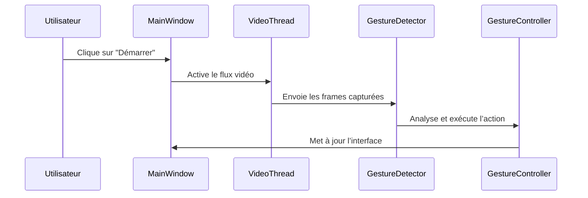

## **– Interface utilisateur**  

### **🔍 Rôle du module**
Le module **MainWindow** gère **l'affichage et l'interaction utilisateur** avec GestureMouseApp.  
✅ **Affiche le flux vidéo** en temps réel 📹  
✅ **Active/désactive la reconnaissance gestuelle** ✋  
✅ **Permet de configurer les paramètres via l'interface** ⚙️  

---

### **⚙️ Fonctionnement interne**
📌 **Cycle d’affichage et interaction utilisateur** :
1️⃣ **Initialisation de la fenêtre** – Création des composants UI  
2️⃣ **Connexion aux autres modules** – Vidéo, détection, contrôles  
3️⃣ **Gestion des événements utilisateur** – Actions sur les boutons  
4️⃣ **Rafraîchissement dynamique de l'affichage**  

💡 **Exemple de code – Création de la fenêtre principale avec PyQt5** :
```python
from PyQt5.QtWidgets import QMainWindow, QLabel, QPushButton

class MainWindow(QMainWindow):
    def __init__(self):
        super().__init__()
        self.initUI()

    def initUI(self):
        self.setWindowTitle("GestureMouseApp")
        self.setGeometry(100, 100, 800, 600)
        self.label = QLabel("Flux Vidéo", self)
        self.label.setGeometry(20, 20, 760, 480)
        self.start_button = QPushButton("Démarrer", self)
        self.start_button.setGeometry(20, 520, 100, 40)
```

📌 **Explication** :
✔ **Fenêtre PyQt5** avec **une zone d'affichage vidéo** 🎥  
✔ **Boutons pour activer/désactiver la reconnaissance** ✋  
✔ **Disposition optimisée pour une interaction fluide**  

---

### **🔗 Interaction avec les autres modules**
📌 **Diagramme de séquence – Interaction entre MainWindow et les composants** :


---

### **📌 Personnalisation et configuration**
📌 **Modifier l'apparence et le comportement de l'interface** :
✔ **Personnalisation des couleurs et icônes** – Modifier `styles/extra.css` 🎨  
✔ **Ajout de nouvelles actions aux boutons** – Modifier `main_window.py` 🔧  
✔ **Adaptation de la taille de la fenêtre** selon les préférences utilisateur  

💡 **Exemple : Ajout d’une icône personnalisée**  
```python
self.setWindowIcon(QIcon("assets/logo.png"))
```

---