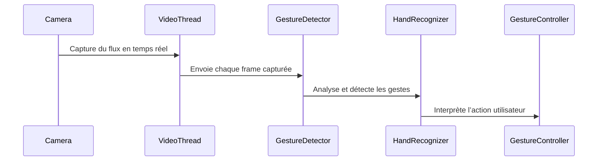

## **– Gestion du flux vidéo et performances**  

### **🔍 Rôle du module**
Le **module VideoThread** assure la **capture en temps réel** du flux vidéo et son **traitement efficace** pour la reconnaissance des gestes.  
✅ **Acquisition du flux vidéo avec OpenCV** 🎥  
✅ **Optimisation de la fréquence d’image (FPS)** pour réduire la latence ⏳  
✅ **Transfert des frames vers GestureDetector pour l’analyse** ✋  

---

### **⚙️ Fonctionnement interne**
📌 **Cycle de gestion du flux vidéo** :
1️⃣ **Initialisation du thread vidéo** pour gérer le flux de manière indépendante  
2️⃣ **Capture des frames et transmission à GestureDetector**  
3️⃣ **Rafraîchissement de l’affichage dans l’interface utilisateur**  
4️⃣ **Optimisation des performances pour un traitement fluide**  

💡 **Exemple de code – Gestion du flux vidéo en thread** :
```python
import cv2
from PyQt5.QtCore import QThread, pyqtSignal

class VideoThread(QThread):
    frame_signal = pyqtSignal(object)

    def __init__(self):
        super().__init__()
        self.cap = cv2.VideoCapture(0)
        self.running = True

    def run(self):
        while self.running:
            ret, frame = self.cap.read()
            if ret:
                self.frame_signal.emit(frame)

    def stop(self):
        self.running = False
        self.cap.release()
```
📌 **Explication** :
✔ **Thread indépendant** pour éviter les blocages de l’interface  
✔ **Signal PyQt5** pour transmettre les frames vidéo  
✔ **Gestion fluide du flux sans ralentissement**  

---

### **🔗 Interaction avec les autres modules**
Le **flux vidéo est capturé et transmis** à **GestureDetector**, qui analyse **les mains visibles**.  

📌 **Diagramme de séquence – Traitement du flux vidéo** :

💡 **Optimisation du cycle permet d’éviter les latences et d’améliorer la réactivité des gestes !**  

---

### **📌 Optimisation des performances**
📌 **Astuces pour un flux vidéo fluide et performant** :
✔ **Limiter la résolution** pour éviter une surcharge du CPU 🖥️  
✔ **Ajuster la fréquence d’image (FPS) selon les capacités du matériel** ⏳  
✔ **Désactiver les affichages inutiles (debug, landmarks trop détaillés)**  

---
